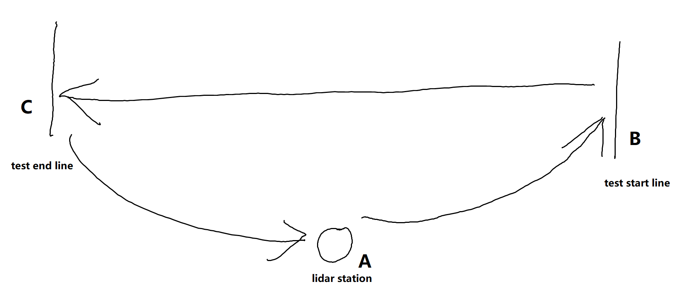

# Testing-new-e-vehicles-for-personal-mobility
TME 180 Automotive Engineering Project Chalmers 

# Read me first
**Every folder contains the whole software for its e-vehicle type**  
i.e. E-bike and conventional bike analysis folder contains the whole software to do the analysis for conventional bikes  
E-bike and conventional bike analysis-without lidar folder contains the whole software to do the analysis for conventional bikes when not considering using lidar data  
E-scooter analysis folder contains the whole software to do the analysis for e-scooters  
Segway and e-skateboard analysis folder contains the whole software to do the analysis both for e-skateboard and segway  

**Each folder, i.e each software has a top code which means that you when run this code (this m file), it will automatically run everything in the architecture.**  
The name of top code files are listed as below  
E-bike and conventional bike analysis : Ebike_unEbike.m  
E-bike and conventional bike analysis-without lidar : Ebike_unEbike.m  
E-scooter analysis : Escooter.m  
Segway and e-skateboard analysis : Segway_and_eskateboard.m  

**Each software follows the same architecture:**  
run ReadIn_lidar_and_bike_sensors.m  
run Save_summarized_datatable.m  
run Split_and_save_tasks.m  
run cut_out_test_slot.m  
run Segmentation_and_PI_compute.m  

**First we recap the procedure of our experiment.**  

**The following description is the timeflow when one task is conducted:**  
The participant stops at lidar station (A), testing staff press the flag button both on lidar and on bike sensor simutanously.  
The participant rides from A to test start line (B).  
The participant stops at B.  
Testing staff press the flag button of lidar and thumb up, showing the participant can start.  
The participant rides from B to test end line (C).  
The participants stop at C.  
Testing staff press the flag button of lidar.  
The participant rides from C to A.  

This timeflow is exactly the same for each task conduction. The real test that we want to analyze is B-->C  

**Now explain the logic of our architecture, more detailed usage read the comments in these m files.**  
ReadIn_lidar_and_bike_sensors.m read in all raw data and extract relevant information.  
Save_summarized_datatable.m save relevant intermediate result.  
Split_and_save_tasks.m cuts out the each procedure A-->B-->C--A from the whole recording  
cut_out_test_slot.m cuts out the real test data B-->C that we want to analyze   
Segmentation_and_PI_compute.m plot signal figures (and do performance indicator computation just for conventional bike)  
